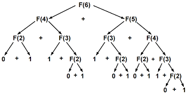

# Programação Dinâmica

Programação dinâmica é uma técnica usada para memorizar 
valores calculados previamente, evitando que o computador 
tenha que repetir a mesma operação diversas vezes.

Obs.: Você pode testar os códigos e comparar os resultados
com os da tabela [deste site](www.osfantasticosnumerosprimos.com.br/011-estudos-228-cem-primeiros-numeros-de-fibonacci.html).

Por exemplo, analise este algoritmo a seguir:  

```int fib (int n) {
    if (n == 0 || n == 1)
        return 1;
    return fib(n-1) + fib(n-2)
```

Obs.: Veja o arquivo [fib_recursivo_sem_pd](fib_recursivo_sem_pd.cpp).

Este algoritmo encontra o n-ézimo número de Fibonacci.

Olhe a àrvore de recursões a seguir e analise o que acontece
para calcular o 6º número de Fibonacci.

<p align='center'>
    
</p>

Perceba que calculamos diversos valores repetidas vezes, e
isso vai escalando conforme o número de Fibonacci que desejamos aumenta.  
Nesta abordagem, após o 50º número de Fibonacci, a execução do problema começa a ficar inviável, demorando cerca de 61 segundos para executar e realizando 25.172.538.049 chamadas recursivas. O fib(72) não obtem resposta mesmo após 30 minutos!

Através da programação dinamica, podemos evitar realizar o mesmo cálculo através de duas abordagens: **top-down** e **bottom-up**. Ambas diminuiram o tempo de execução e 

## Bottom-up

De baixo para cima.

```
#define MAXN 92

int main () {
    long long fib[MAXN];
    int n = 10;

    fib[0] = fib[1] = 1;
    for(int i = 2; i < MAXN; i++) {
        fib[i] = fib[i-1] + fib[i+2];
    }

    cout << fib[n-1];
}
```

Começamos dos menores valores possíveis e calculamos todos os possíveis valores de entrada a partir da base.

Obs.: Escolhemos no número 92, pois estourariamos o limite do `long long` se quisessemos calcular mais números.

Esta abordagem calcula todos os números de fibonacci em tempo linear, levando aproximadamente 10^-7 segundos para calcular todos os números da base até o topo.

Obs.: Veja o arquivo [fib_bottom-up](fib_bottom-up.cpp).

## Top-down

Funciona de forma similar ao bottom-up, mas desta vez usaremos a recursão para calcular de baixo para cima.

```
#define MAXN 92
 
long long dp[MAXN];

long long fib (int n) {
    if (n == 0 || n == 1)
        return dp[n] = 1;
    if (dp[n] != -1)
        return dp[n];
    return dp[n] = fib(n-1) + fib(n+2);
}
```
OBS.: Veja o arquivo [fib_top-down](fib_top-down.cpp).