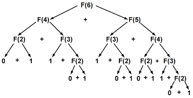

# Programação Dinâmica

Programação dinâmica é uma técnica usada para memorizar 
valores calculados previamente, evitando que o computador 
tenha que repetir a mesma operação diversas vezes.

Obs.: Você pode testar os códigos e comparar os resultados
com os da tabela [deste site](www.osfantasticosnumerosprimos.com.br/011-estudos-228-cem-primeiros-numeros-de-fibonacci.html).

Por exemplo, analise este algoritmo a seguir:  

```int fib (int n) {
    if (n == 0 || n == 1)
        return 1;
    return fib(n-1) + fib(n-2)
```

Obs.: Veja o arquivo [fib_recursivo_sem_pd](fib_recursivo_sem_pd.cpp).

Este algoritmo encontra o n-ézimo número de Fibonacci.

Olhe a àrvore de recursões a seguir e analise o que acontece
para calcular o 6º número de Fibonacci.

<p align='center'>
    
</p>

Perceba que calculamos diversos valores repetidas vezes, e
isso vai escalando conforme o número de Fibonacci que desejamos aumenta.  
Nesta abordagem, após o 50º número de Fibonacci, a execução do problema começa a ficar inviável, demorando cerca de 61 segundos para executar e realizando 25.172.538.049 chamadas recursivas. O fib(72) não obtem resposta mesmo após 30 minutos!

Através da programação dinamica, podemos evitar realizar o mesmo cálculo através de duas abordagens: **top-down** e **bottom-up**. Ambas diminuiram o tempo de execução e 

## Bottom-up

De baixo para cima.

```
#define MAXN 92

int main () {
    long long fib[MAXN];
    int n = 10;

    fib[0] = fib[1] = 1;
    for(int i = 2; i < MAXN; i++) {
        fib[i] = fib[i-1] + fib[i+2];
    }

    cout << fib[n-1];
}
```

Começamos dos menores valores possíveis e calculamos todos os possíveis valores de entrada a partir da base.

Obs.: Escolhemos no número 92, pois estourariamos o limite do `long long` se quisessemos calcular mais números.

Esta abordagem calcula todos os números de fibonacci em tempo linear, levando aproximadamente 10^-7 segundos para calcular todos os números da base até o topo.

Obs.: Veja o arquivo [fib_bottom-up](fib_bottom-up.cpp).

## Top-down

Funciona de forma similar ao bottom-up, mas desta vez usaremos a recursão para calcular de baixo para cima.

```
#define MAXN 92
 
long long dp[MAXN];

long long fib (int n) {
    if (n == 0 || n == 1)
        return dp[n] = 1;
    if (dp[n] != -1)
        return dp[n];
    return dp[n] = fib(n-1) + fib(n+2);
}
```
OBS.: Veja o arquivo [fib_top-down](fib_top-down.cpp).

## O problema do troco

Um problema muito comum, é o problema do troco e suas variações. Veja [aqui](https://neps.academy/br/exercise/308) um exemplo. Pense sobre e depois veja o arquivo [Vei_da_Meu_Troco](Vei_da_Meu_Troco.cpp), que contém a resolução.

Perceba que o problema 8.1 do livro Cracking the Coding Interview, é uma variação do problema do troco. Suponha que n é o valor, 1, 2 e 3 são as moedas disponíveis e precisamos de uma dp que guarde de quantas maneiras podemos chegar a determinado valor.

**Problema 8.1**: A child is runnign up a staircase with n steps and can hop either 1 step, 2 step, or 3 steps at a time. Implement a method to count how many possible ways the child can run up the stairs.

Você pode ver a resposta para este problema [aqui](https://www.geeksforgeeks.org/count-ways-reach-nth-stair-using-step-1-2-3/).